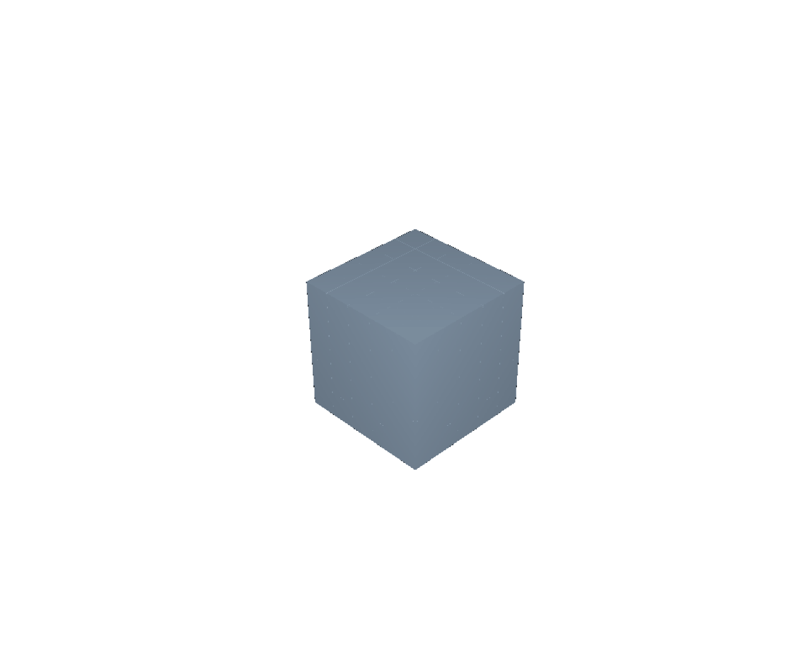
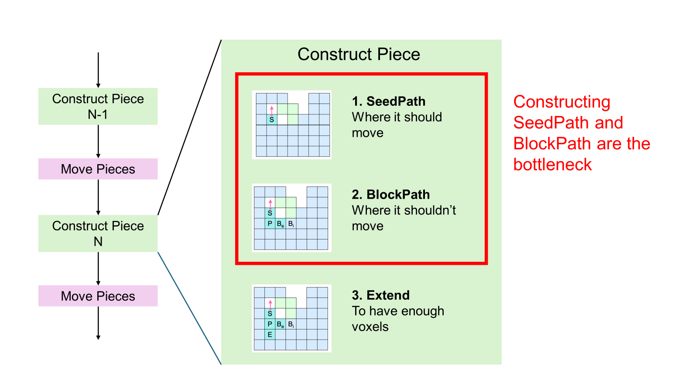
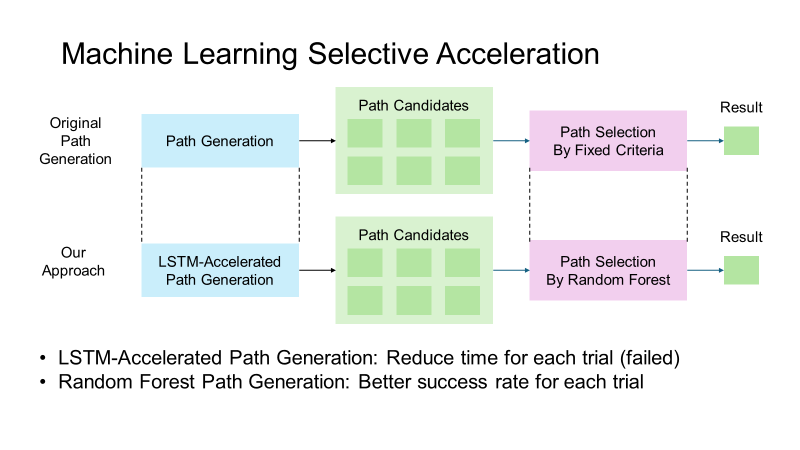
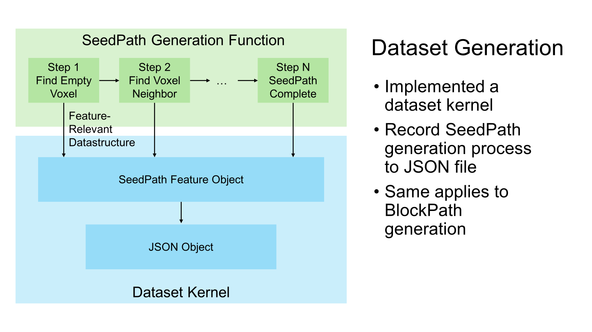
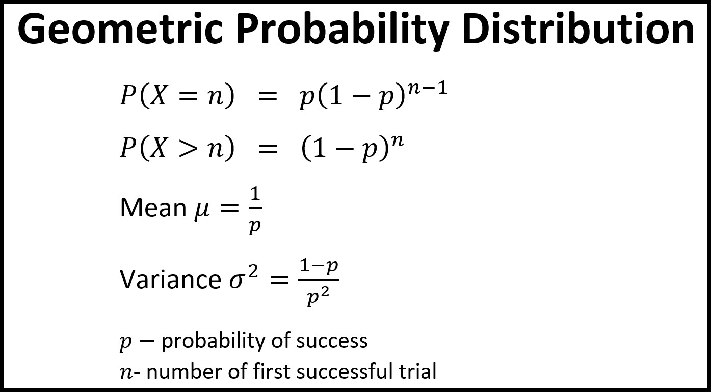
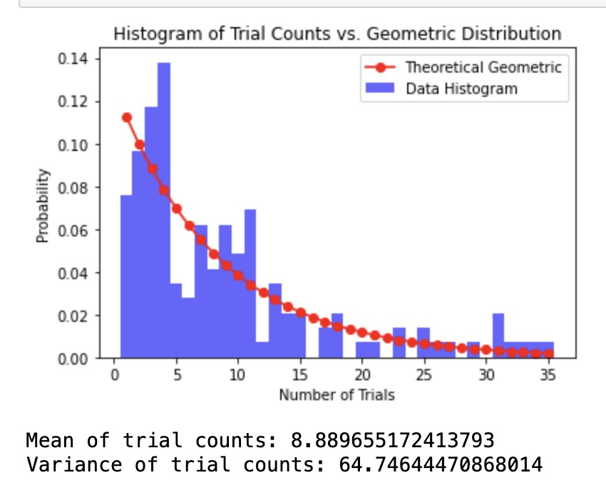
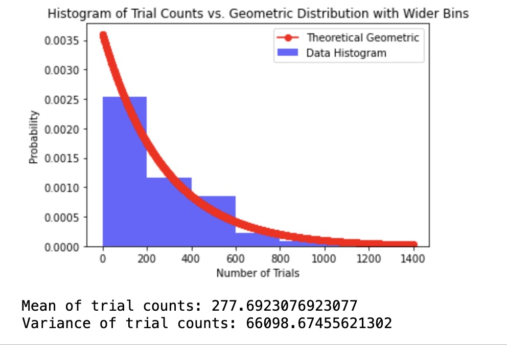
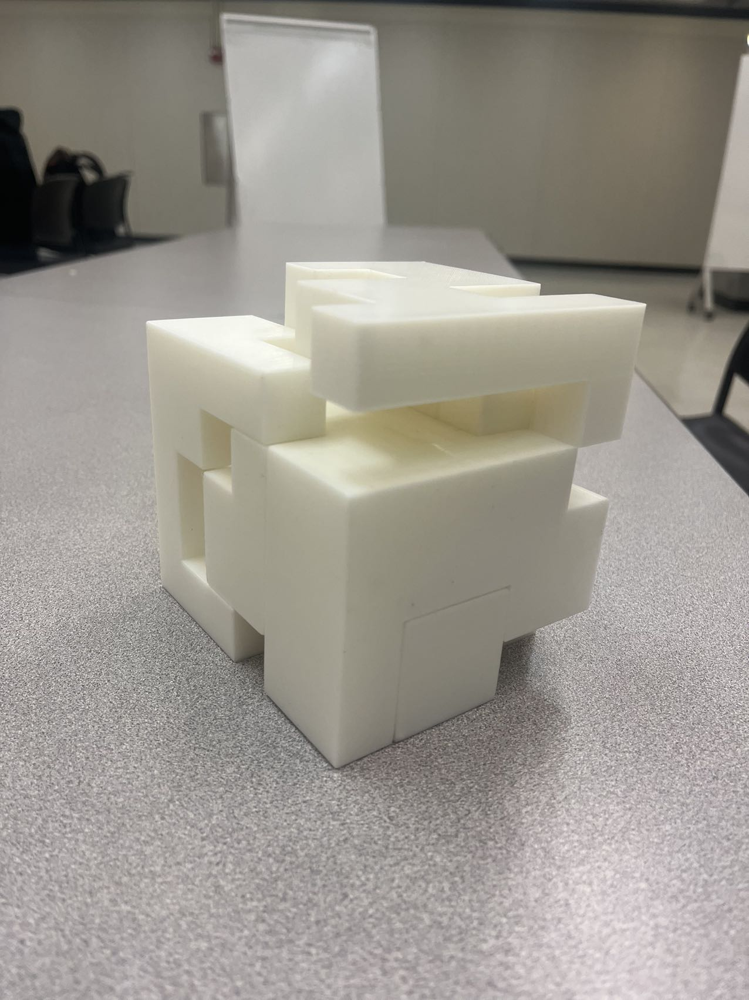

# Machine Learning Enhanced Computational Design of High-level Interlocking Puzzles

By Ruhao Tian, Yunshen Song, Zixuan Wan, Zineng Tang

Video: [Final Project Video](https://drive.google.com/file/d/1A5tIM0bmZq5TBEFfIzzvOMdcbp7rW2Gp/view?usp=sharing)

## Abstract
Interlocking puzzles are a fascinating application of computational design, but generating complex high-level puzzles is extremely time consuming due to the large number of trials required. This paper explores accelerating the puzzle generation algorithm using machine learning. We profile the algorithm to identify the bottleneck in computing seed and block paths for each puzzle piece. To accelerate this bottleneck, we generate training data by recording the path generation process and train a machine learning model to predict high-quality paths, bypassing many expensive trials. Benchmarking shows the generation time follows a geometric distribution. Applying our ML model achieves a speedup in generating challenging puzzles like the 3D spider. With this acceleration, we can generate complex puzzles in XX minutes instead of hours, enabling more efficient iteration to optimize puzzles for manual assembly. We 3D print an example puzzle to validate that our approach produces stable, physically-realizable interlocking designs.

## Introduction
Interlocking puzzles are a captivating application of computational design, offering both an engaging challenge for puzzle solvers and a testbed for computer-aided design algorithms. Creating puzzles with intricate, interleaving pieces requires considering numerous geometric constraints to ensure a stable final assembly with a unique disassembly path. Optimizing puzzles to be both challenging and feasible to assemble is a complex task that requires many iterations of piece design and layout.
Recent work by Song et al. [1] proposed an algorithm to generate high-level interlocking puzzles through many trials to discover piece geometries that satisfy the numerous constraints. While effective at producing complex designs, a key limitation is the runtime: generating a single puzzle can take hours due to the large number of trials required.
In this work, we explore accelerating the puzzle generation algorithm using machine learning (ML). We analyze the algorithm to identify bottlenecks and find that the majority of time is spent computing \textit{seed paths} and \textit{block paths} that determine the geometry of each piece. To accelerate this step, we propose using ML to predict high-quality paths, bypassing a large number of expensive trial-and-error iterations.
We implement the puzzle generation algorithm and profile its performance on a variety of 3D models. We measure the distribution of generation times and find it follows a geometric distribution, enabling principled benchmarking. We then instrument the algorithm to record training data consisting of seed and block paths and train an ML model to predict them.
Applying our ML model to the path generation step achieves a speedup on a complex spider puzzle, reducing generation time from over 15 hours to just YY minutes. We evaluate the puzzles produced by our accelerated approach and find they maintain the key properties of the baseline algorithm. We further validate our approach by 3D printing a puzzle and physically assembling it.
In summary, we present the first machine learning approach to accelerating computational interlocking puzzle design, demonstrating significant speedups on complex models. Our approach enables rapid iteration to optimize puzzles for manual assembly and opens the door to generating larger and more intricate designs. We release our code and data to facilitate future research in this area.

## Technical Approach

### Early Attempts of CUDA Migration

In the very early stage of our project, we decided to implement a CUDA-accelerated puzzle generator based on the SIGGRAPH 2022 paper "Computational Design of High-level Interlocking Puzzles". The paper introduces a novel method to generate high-level interlocking puzzles with a variety of constraints. However, the method is time-costly and we believe that it can be significantly accelerated by parallelizing the computation on GPU.

The method proposed by the paper is based on 'trials and errors'. It may take thousands of independent trials to generate a disassemblable puzzle. Our original idea is to move the trials to GPU and run them in parallel, which can significantly reduce the time cost.

We believed that we could directly migrate the original C++ code to CUDA code without significant changes. However, after extensive exploration, the difficulty of CUDA programming became apparent. CUDA does not support dynamic data structures, which forced us to redirect our approach.

The key algorithm of the proposed method heavily involves graph traversal. The original C++ code implementation consists of dynamic data structures, e.g. `std::vector` to store the intermediate results. After extensive testing, we believe that it is impractical to directly migrate the original C++ code to CUDA code given the time and resources available to us. Even if we brutally replace all the `std::vector` with fixed-size arrays, the code would become inefficient because all expansions to arrays would require copying the entire array to a new location.

This understanding is a significant setback, but we believe GPU acceleration is still possible. Instead of directly migrating all the original C++ code to CUDA code, we now need to carefully select parts of the algorithm we want to accelerate and redesign the algorithm to fit the CUDA programming model.

### Profiling and Bottleneck Identification

To identify our selective acceleration target, we profile the implementation of the paper in search of a bottleneck. The implementation of the paper executes on the Linux platform and our group members either use macOS or virtualized WSL on Windows, consequently, we profile both platforms to minimize the difference. We use `perf` on WSL and Xcode Instruments on macOS to profile the original C++ code.

Profiling results from both platforms identically show that the bottleneck of the original algorithm is computing the main path when creating a new piece, which consumes around 80% of execution time in some cases.

To elaborate, within each trial of the algorithm, every piece of the puzzle is created by (1) finding a small set of seed voxels `SeedPath` that is movable in the target direction, (2) adding a set of block voxels `BlockPath` to prevent movement in other directions, and (3) adding voxels with small reachability to extend the piece. According to the profiling results, (1) and (2) are the most time-consuming parts of the algorithm.

### Selective Acceleration by Machine Learning

#### Algorithm

The path generation process in the original algorithm can be abstracted into two steps. First, the algorithm generates six candidate paths through complicated voxel space traversal. Second, the algorithm selects the best path as the final result. The selection criteria are based on the reachability of the path and the number of voxels in the path.

The heuristic of the original algorithm does not guarantee a global optimal solution, e.g. could lock into each other and produce deadlocks. We believe that a machine learning model can learn the heuristic from the original algorithm and provide a better selection of paths. Specifically, we implemented a random forest model [2] and fed the path information as well as whether the final puzzle configuration is solvable, aiming to provide a better success rate for each trial and increase efficiency.

For the puzzle generation algorithm, we attempted to implement a long short-term memory (LSTM) model [3] to predict the reachability of the path. However, the LSTM model did not perform well in our experiments. Possible reasons include the lack of training data and the complexity of the LSTM model. Unfortunately, we did not have enough time to further explore the LSTM model.

#### Dataset Generation

To gather data for training, we implemented a dataset kernel to record the generation process of `SeedPath` and `BlockPath`.

When the `SeedPath` generation starts, a `seedPathCreationSequence` is created to record the intermediate states of the `SeedPath`. Every time the `SeedPath` changes, the updated `SeedPath` is appended to the `seedPathCreationSequence`. The final `seedPathCreationSequence` is saved to a JSON file. The same process is applied to `BlockPath`.

### Benchmarking

Measuring the performance of the original program and our implemented acceleration requires a uniform standard. This is hard for the puzzle generator as too many random factors are involved, and each generation with the same parameter can take a significantly different amount of time. We decided to explore the probability distribution of the generation time and use it as a standard to compare the performance of the original program and our implemented acceleration.

Intuitively, we determined that it should fit a geometric distribution since we are testing how many trials it would take for the program to output a successful build. To verify our hypothesis, we need to gather trial data, but this cannot be done alone since there are multiple shapes and each run would take all of the GPU, meaning that we can only process one shape at a time. After all, we were determined to process 2 different shapes.

The first shape we chose is the spider because it is the most complex and takes the longest to run, so we hope that we can spot significant improvement after implementing our machine-learning model. The second shape we chose is the 5x5x5 cube, since it was the simplest of them all and takes the shortest time to run. 

We gathered 66 different trials of spiders with an average run time of 15.9 minutes and an average trial of 277.7. We gathered 145 different trials of cubes with an average run time of 0.900 minutes and an average trial of 8.9. Below are the graphs and the statistics: 

#### Cube

#### Spider

From the graph above, we can see that the geometric distribution is a great fit for the data. Furthermore, the variance of both shapes is approximately equal to the square of the mean. This is strong evidence that our data follows the geometric model.

Next, we will use our approximated geometric distribution to determine the improvement of our machine-learning model.

## Results

### 3D Printing

### Data Analysis

Our current model aims to improve on the number of trials to find a successful build for Spiders and Cubes by choosing plausible seed paths instead of speeding up the process of seed path. Due to the amount of time spent on optimizing the machine-learning models, we perfected the model rather late, leaving us with limited time to thoroughly test it. 
Below is the data we gathered from integrating our machine learning models:

For spiders, the average trial number is 74.7(we have collected 8 runs so far, one of which is over 700 which we think a deadlock had occurred and we didn’t include it), and the average minutes per trial is 0.05732. Even adding the outlier, our average trial number would still be under 200. This stayed roughly the same from the earlier average trial time of 15.9 minutes divided by 277.7 = 0.057 minutes per trial. We think that this doesn't necessarily show improvement and the state of the computer at runtime would play a much bigger role. The trail number also improved by an average of 203 per process. Even though the dataset is small, with such a large improvement this shows that our machine learning model is successful at improving the trial number of spiders. We found that under different systems, the same seed number would lead to different results so we would have different trial and test dataset. 

For cubes, the trial nums is 9.485. This is expected as cubes are relatively fast to finish and we don’t have high hopes of improving. The running time on the other hand was consistently smaller than 0.05 per process. We used a different computer to test the cubes due to technical issues, so not much can be concluded here.

## Conclusion
In this work, we present a machine learning approach to accelerate the computational design of interlocking 3D puzzles. We profile the state-of-the-art algorithm to identify performance bottlenecks in generating seed and block paths for puzzle pieces. We instrument the algorithm to gather training data and train a random forest model to predict high-quality paths, reducing the number of expensive trial-and-error iterations.

## References

**[1]** SIGGRAPH 2022 paper "Computational Design of High-level Interlocking Puzzles" [ACM Digital Library](https://dl.acm.org/doi/abs/10.1145/3528223.3530071)

**[2]** Recursive interlocking puzzles [ACM Digital Library](https://dl.acm.org/doi/10.1145/2366145.2366147)

**[3]** Rigatti, Steven J. "Random forest." Journal of Insurance Medicine 47.1 (2017): 31-39.

**[4]** Yu, Yong, et al. "A review of recurrent neural networks: LSTM cells and network architectures." Neural computation 31.7 (2019): 1235-1270.

## Contributions

Zixuan&Yunshen: Benchmarking, result analysis, 3D printing and sanding.

Zineng: Machine learning algorithm, improvement and integration with the puzzle algorithm.

Ruhao: Profiling, data kernel, project design.